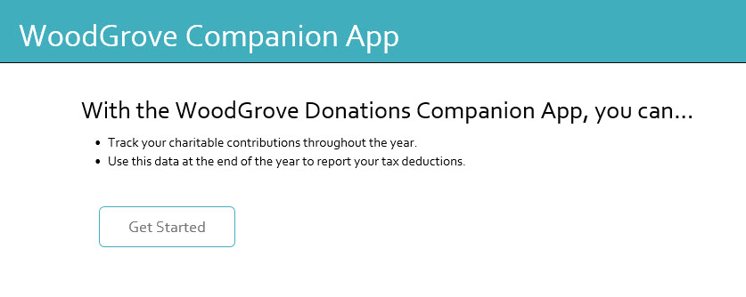

# Microsoft Graph Excel ASP.NET donations sample

This sample shows how to read and write into an Excel document stored in your OneDrive for Business account by using the Excel REST APIs.

## Prerequisites

To use the Microsoft Graph Excel ASP.NET donations sample, you need the following:
* Visual Studio 2015 installed and working on your development computer. 

     > Note: This sample is written using Visual Studio 2015. If you're using Visual Studio 2013, make sure to change the compiler language version to 5 in the Web.config file:  **compilerOptions="/langversion:5**
* An Office 365 account. You can sign up for [an Office 365 Developer subscription](https://aka.ms/devprogramsignup) that includes the resources that you need to start building Office 365 apps.

     > Note: If you already have a subscription, the previous link sends you to a page with the message *Sorry, you can’t add that to your current account*. In that case use an account from your current Office 365 subscription.

## Register the app

1. Sign in to the [Azure portal](https://portal.azure.com/).
2. If you have multiple tenants, click your account on the top bar and under the **Directory** list, choose the Active Directory tenant where you wish to register your application.
3. In the left- hand nav, click **Azure Active Directory**. If it's not showing, click **More Services** > **Azure Active Directory**.
4. Click **App registrations** and then click **Add**.
5. Enter a friendly name for the application, select *Web app/API* as the **Application Type**, and then  enter *http://localhost:21942/* for the **Sign-on URL**. 
6. Click **Create** to create the application, and then choose your application from the list of applications. 
7. In the **Essentials** pane, find the Application ID and copy it.
8. Configure permissions for your application:  
  a. In the **Settings** pane, choose **Required permissions**. Click **Add**, choose **Select an API** > **Microsoft Graph**, and then click **Select**.  
  b. Click **Select permissions** and choose the **Have full access to all files user can access** delegated permission. Click **Select**, and then click **Done**.
9. In the **Settings** pane, choose **Keys**. Enter a description and select a duration for the key. Click **Save**.
10. **Important**: Copy the key value now. You won't be able to access this value again after you leave this pane. You will use this value as your app secret.

## Configure the app
1. Open **Microsoft-Graph-ASPNET-Excel-Donations.sln** file. 
2. In Solution Explorer, open the **Web.config** file. 
3. Replace *ENTER_YOUR_CLIENT_ID* with the client ID of your registered Azure application.
4. Replace *ENTER_YOUR_SECRET* with the key of your registered Azure application.
5. Upload the **WoodGroveBankExpenseTrendsWorkbook.xlsx** file included in this repo to the root OneDrive directory of your Office 365 tenant. The app won't work without this workbook, which stores the data in your donations list.

## Run the app

1. Press F5 to build and debug. Run the solution and sign in with your Office 365 account. The application launches on your localhost and shows the starter page. 

     > Note: Copy and paste the start page URL address **http://localhost:21942/home/index** to a different browser if you get the following error during sign in:**AADSTS70001: Application with identifier ad533dcf-ccad-469a-abed-acd1c8cc0d7d was not found in the directory**.
2. Select the `Get Started` button.
3. The application displays the donations page. Select the `Add New` link to add a new task. Fill in the form with the donation details.
4. After you add a donation, the app shows the updated donations list. If the newly added donation isn't updated, choose the `Refresh` link after a few moments.

## Contributing ##

If you'd like to contribute to this sample, see [CONTRIBUTING.MD](/CONTRIBUTING.md).

This project has adopted the [Microsoft Open Source Code of Conduct](https://opensource.microsoft.com/codeofconduct/). For more information see the [Code of Conduct FAQ](https://opensource.microsoft.com/codeofconduct/faq/) or contact [opencode@microsoft.com](mailto:opencode@microsoft.com) with any additional questions or comments.

## Questions and comments

We'd love to get your feedback about the Microsoft Graph Excel REST API ASP.NET Donations sample. You can send your questions and suggestions to us in the [Issues](https://github.com/microsoftgraph/aspnet-donations-rest-sample/issues) section of this repository.

Questions about Office 365 development in general should be posted to [Stack Overflow](https://stackoverflow.com/questions/tagged/MicrosoftGraph). Make sure that your questions or comments are tagged with [MicrosoftGraph].
  
## Additional resources

* [Microsoft Graph documentation](https://graph.microsoft.io)
* [Other Microsoft Graph ASP.NET samples](https://github.com/MicrosoftGraph?utf8=%E2%9C%93&q=aspnet)

## Copyright
Copyright (c) 2016 Microsoft. All rights reserved.
